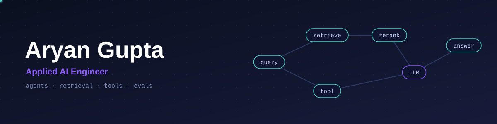

  

# Hi 👋, I'm Aryan Gupta

### Applied AI Engineer building RAG systems, LLM agents, and the backend infra underneath them

---

- 🔭 Currently building **MuleWatch** — an AI investigation copilot for money-mule fraud alerts
- 🌱 Going deeper into **agentic workflows**, retrieval quality, and **LLMOps**
- 💬 Ask me about **RAG pipelines, LangGraph agents, hybrid search, FastAPI backends**
- ⚡ Fun fact: I trust a gold-set eval more than a good-looking demo

---

### 🚀 Featured Projects

| Project | What it does |
|---|---|
| **[GovPrep](https://github.com/thearyangupta/govprep)** | Source-cited RAG study assistant for UPSC/CDS/SSC, hybrid retrieval + LangGraph ReAct agent |
| **[FlowPilot AI](https://github.com/thearyangupta/flowpilot-ai)** | Email-triage automation platform — classifies, drafts, and holds replies for human approval |
| **[Fraud Risk Intelligence Engine](https://github.com/thearyangupta/fraud-risk-intelligence-engine)** | Leakage-safe fraud scoring pipeline — temporal splits, XGBoost, frozen decision policy |
| **[Reading the Signals](https://github.com/thearyangupta/reading-the-signals)** | Gemini-powered reflection journal built for Google Cloud's Gen AI Ideathon |
| **[Expense Tracker MCP](https://github.com/thearyangupta/expense-tracker-mcp)** | Local MCP server exposing expense-tracking tools via FastMCP + PostgreSQL |

---

### 🛠️ Languages & Tools

**GenAI/LLM:** LangGraph · LangChain · RAG · Hybrid Search (BM25 + Dense + RRF) · MCP · Gemini API 
**ML/Data:** XGBoost · scikit-learn · pandas 
**Backend/Infra:** FastAPI · PostgreSQL · pgvector · SQLAlchemy · Docker · GitHub Actions · Google Cloud Run · Firebase/Firestore

---

### 📊 GitHub Stats

